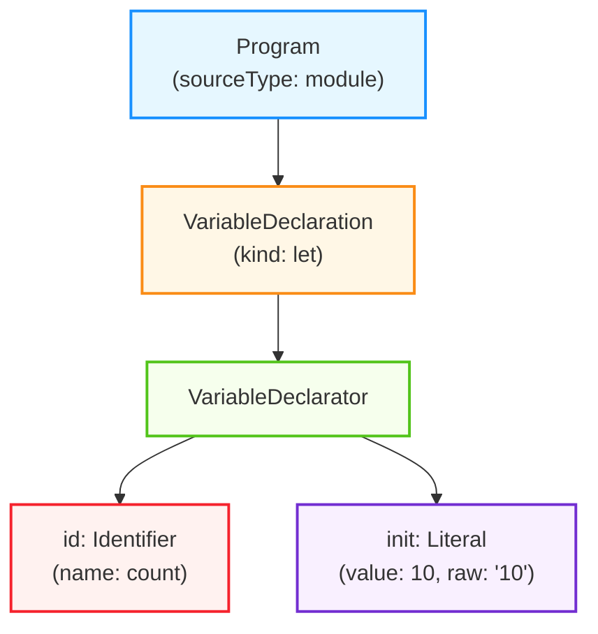

それでは発表させていただきます。よろしくお願いします。

早速ですが、皆さんのチームではTypeScriptのコーディング規約をどのように管理していますでしょうか？
TypeScript や JavaScript のベストプラクティスに準ずるような、基本的なコーディング規約は ESLint などのツールを使用されていることが多いと思います。  
では、チーム独自のコーディング規約についてはどうでしょうか？これらはドキュメント化されていることもあれば、暗黙の了解となっていることも多いと思います。

コーディング規約の運用の理想は、チーム独自や社内独自、あるいは、特定のライブラリ独自 といった、スコープが狭いコーディング規約についても運用も自動化し、レビューコストを上げずに、チーム全体のコードの品質や安全性を高めることだと思います。
今回は、そのアプローチとして、「特定の領域のコーディング規約を、ESLintルールとして定義する」という内容について、ESLintカスタムルールの開発入門というタイトルで発表させていただきます。

---

自己紹介です。山梨と申します  
株式会社メイツで Web エンジニアをしております  
プライベートでは、AWS CDK という IaC ツール (インフラをコードで構築するツール) のコントリビュートをしたり、CDK 用の ESLint プラグインを開発したりしています  

今回のスライドでは、コードを使用している箇所が多いので、もし見ずらい方は、こちらのQRコードを読み取っていただくか、Xの方で、`tskaigi`というハッシュタグでツイートしておりますので、そちらご覧ください。  

---

本セッションの目的とは、先ほどの通り、カスタムルールの開発手法を知り、より詳細な粒度でコーディング規約を自動化できるようにすることです。  

このセッションでは、そういったカスタムルール開発の理解を深めるためのお話を、段階的にいたします。  
具体的にはこちらの流れでお話しします。

```md
1. ESLint とは  
2. AST とは
3. ESLint を使用したカスタムルールの開発
4. typescript-eslint を使用した 型情報 Lint ルールの開発
```

最初に、ESLint や ESLint カスタムルールの概要についてお話しします。  
そして、ESLint カスタムルールの開発に不可欠である、AST の概要についてお話しします。  
AST というと難易度が高い印象を受ける方も多いかもしれませんが、今回は入門として、コードを例に挙げながら、大まかな概要について触れていきます。  
その後、実際にシナリオを立てて、ESLint カスタムルールの開発、型情報を使用した カスタムルールの開発へと進みます。

ではまず、ESLint についてです

---

ESLint とは、JavaScript の Linterで、一貫性のあるコードを書くためだったり、コードの品質や安全性を高めることを目的として使用されると思います。  
このESLint の特徴としては、typescript-eslint により TypeScript 構文がサポートされる点、そして、カスタムルールなどの開発が可能で、拡張性が高い点が挙げられます。
カスタムルールと聞くとあまり馴染みがないように思えますが、例えばeslint-plugin-vue, eslint-plugin-react のような、普段使用しているライブラリやそのコミュニティによって提供されるプラグインも、カスタムルールの一つです。

ここからは、そのカスタムルールの概要についてまとめます。  
ESLint には、カスタムルールを作成するためのモジュール、インターフェースがあり、その提供されたインターフェースに沿って記述することで、カスタムルールを開発することができます。  
ここで記述されたカスタムルールは、eslint が AST を 探索 (走査) する際にフックされ、呼び出されます。
そのため、ESLint から提供された AST を参照し、それを元に、特定の条件に従うかを判定する実装を行う。というのが、カスタムールール開発の主な内容になります。

```ts
import { Rule } from "eslint";

export const sampleRule: Rule.RuleModule = {
  meta: {
    // ルールのメタデータを記述
  },
  create(context) {
    // ルールを記述
  },
};
```

例えば、チームのコーディング規約として、if文は必ず Block を使用したい。つまり波括弧で囲うようにしたいというユースケースがあると仮定した場合、カスタムルールの内容はこちらのコードのようになります。  

```ts
import { Rule } from "eslint";

export const requireIfBlock: Rule.RuleModule = {
  meta: {
    type: "problem",
    docs: {
      description: "if文を Block Statement で記述することを強制する",
    },
    messages: {
      requireIfBlock: "if文にブロックを使用してください",
    },
  },
  create(context) {
    return {
      IfStatement(node) {
        if (node.consequent.type !== "BlockStatement") {
          context.report({
            node,
            messageId: "requireIfBlock",
          });
        }
      },
    };
  },
};
```

このコードでは、`node`という変数名で JavaScript の AST を受け取り、それに対する操作を行なっています。  
このように、ESLint のカスタムルールを実装する際には、ASTへの理解が求められます。  

そのため、ここからは、AST の概要についてお話しします。

---

AST とは、ソースコードをパースした抽象構文木、Abstract Syntax Tree のことで、JavaScript の場合は JSONとして表現されます。  
例えば、`let count = 10`というコードは、非常に単純化すると、こちらのようなJSON構造で表現されるといったイメージです。  

```json
{
  "type": "Program",
  "body": [
    {
      "type": "VariableDeclaration",
      "declarations": [
        {
          "type": "VariableDeclarator",
          "id": {
            "type": "Identifier",
            "name": "count"
          },
          "init": {
            "type": "Literal",
            "value": 10,
            "raw": "10"
          }
        }
      ],
      "kind": "let"
    }
  ],
  "sourceType": "module"
}
```

この JSON をグラフで表すと、こちらのようになります。



このように、ASTはコードの構造を階層的に表現する「木構造」です。そして、各ノードがコードの一部を表し、そのノード間の親子関係がコードの構文的な関係を示します。

こちらのJSONを見てみると、最上位の`Program`ノードの中に、`VariableDeclaration`つまり変数宣言のノードがあることがわかります。  
この変数宣言は`kind: "let"`で宣言の種類を示し、`declarations`配列の中に具体的な変数情報を持っています。

その中の`VariableDeclarator`ノードが、変数名と初期値の情報を表しています。

このように、たった1行のコードであっても、ASTはその構造を明確に階層化して表現しています。

そのASTをソースコードから生成する流れとしては、こちらの図のようになります。  


まずソースコードを字句解析してトークンに分解し、そのトークンを構文解析してASTを生成するといった流れです。

ここでの字句解析とは、ソースコードを予約語、変数名、記号などの、ある程度の意味の塊に分解することです。  
先ほどの、`let count = 10` というソースコードを字句解析すると、  
`let` と `count` と `=` と `10` と `;(セミコロン)` という単位に分解されます。

字句解析によって生成されたトークンは、構文解析器によって解析され、トークンの意味だったり、並び方を見て、階層構造を構築し、ASTが生成されます。  
ここで生成されるASTでは、スペースの数など、表面的な表現の違いが吸収され、コードの本質的な意味や構造だけを抽出して表現されます。  
ASTとはAbstract Syntax Tree の略ですが、この Abstract, つまり抽象とは、スペースの数などといった表面的な表現の違いに左右されないことを意味します

ちなみに、ESLint では、ソースコードからASTを生成するといったパース処理を、`espree`というparserを使用して行っています。

---

ここまで、ASTの概要について触れていきました。  
ここからは、実際にシナリオを立てて、そのシナリオを元にカスタムルールを開発していきます。  
最終的には型情報を使用したルールについてお話ししますが、段階的に進めるために、まずは、ESLint のみを使用したカスタムルールの開発についてお話しします。  
ここでは型情報を扱わず JavaScript コードを対象として、ざっくりとしたカスタムルールの開発の流れを掴みます。  

今回は、if文は必ず Block を使用したいというユースケースがあると仮定して、ルールを作成していきます。  
ルール開発の流れとしては、このようになります。

```md
1. 正常ケース・異常ケースのコード考える
2. それぞれのケースのコードのASTを見ながら、ルールを実装する
3. テストを実装する
```

まず、テストケースとして、どのようなコードを正常とし、どのようなコードを異常とするのかを考えます。  
その後、正常系、異常系それぞれのコードのASTの内容を見ながら、ルールを実装していきます。  
最後に、テストの実装を行います。  

今回実装するルールは非常に単純なものですが、ルールの複雑性が増しても、基本的な開発の流れは同じです。  

---

ではまず、テストケースについてです。
今回の、「if文に必ずBlockを使用する」というルールのテストケースを考えると、こちらのように、Block が使われている。つまり`{}`で囲われている場合は正常なケースとし、Blockが使われていない(`{}`で囲われていない場合は)エラーとします。  

こちらのコードを元に、実際のASTを見てみます。  
コードのASTを見る際には、 [ast explorer](https://ast-explorer.dev/) というサイトが非常に便利です  
このセッションで紹介しているASTはそのサイトで確認した AST を 非常に単純化にしたものを使用しております。  
こちらがその AST の内容です。

正常としたいコードのASTと、異常としたいコードのASTを比較してみると、`IfStatement`のノードのプロパティである`consequent`の中身に違いがあることが確認できます。  
正常としたいASTの方では、`consequent`のtypeが`BlockStatement`であるのに対し、異常としたいASTの方は、`ExpressionStatement`となっています。

```jsonc
// 正常系
{
  "type": "Program",
  "body": [
    {
      "type": "IfStatement",
      "test": {
        "type": "Literal",
        "value": true,
        "raw": "true"
      },
      "consequent": {
        "type": "BlockStatement",
        "body": [
          {
            "type": "ExpressionStatement",
            "expression": {
              "type": "CallExpression",
              "callee": {
                "type": "Identifier",
                "name": "sampleFn"
              },
              "arguments": [],
              "optional": false
            }
          }
        ]
      }
    }
  ],
  "sourceType": "module"
}
```

```jsonc
// 異常系
{
  "type": "Program",
  "body": [
    {
      "type": "IfStatement",
      "test": {
        "type": "Literal",
        "value": true,
        "raw": "true"
      },
      "consequent": {
        "type": "ExpressionStatement",
        "expression": {
          "type": "CallExpression",
          "callee": {
            "type": "Identifier",
            "name": "sampleFn"
          },
          "arguments": [],
          "optional": false
        }
      }
    }
  ],
  "sourceType": "module"
}
```

これを元に自然言語でルールを定義すると、「`IfStatement`のconsequentが`BlockStatement`でない場合はエラーにする」というようになります。

これを実際にコードに落すと、こちらのようになります。

```ts
import { Rule } from "eslint";

export const requireIfBlock: Rule.RuleModule = {
  meta: {
    type: "problem",
    docs: {
      description: "if文を Block Statement で記述することを強制する",
    },
    messages: {
      requireIfBlock: "if文にブロックを使用してください",
    },
  },
  create(context) {
    return {
      IfStatement(node) {
        if (node.consequent.type !== "BlockStatement") {
          context.report({
            node,
            messageId: "requireIfBlock",
          });
        }
      },
    };
  },
};
```

今回定義するルールは、`IfStatement` のノードに対する操作を行いたいので、`create`メソッドの`return`に`IfStatement`を指定しています。  
これにより、eslint が `IfStatement` のノードを探索する際に、記述した処理が実行されます。  

そして、定義した通り、consequent の type が `BlockStatement` でない場合はエラーにします。  

ルールの実装は、これで終わりです。  
JavaScript コードを対象とした ESLintのルール実装は、このように、ほとんどの場合で AST に沿って実装していく作業になります。

<br />

さて、ここまでで、ルールの実装が完了しましたので、最後にテストを実装します。  

テストを実装する際には、eslint から提供される `RuleTester`というモジュールを使用します。
そして、こちらのコードのように、ruleTesterの`run`メソッドを使用して、テスト対象のモジュールを指定し、正常系・異常系のテストケースを書きます。

テストの実行は、vitest, jest など、普段使用しているテストフレームワークで行えます。  
ここまでが、カスタムルールの基本的な開発の流れになります。

なんとなく、カスタムルール作成の流れを掴んだところで、本題である、型情報を使用したカスタムルールの開発についてお話ししたいと思います。

---

型情報を扱うESLintカスタムルールの開発をする際には、`typescript-eslint`を使用するのが基本的です。

この`typescript-eslint`をESLintプラグインとして使ったことのある方が多いと思いますが、typescriptプロジェクトで、これを使う理由は大きく分けて二つあると思っています。

一つ目は、TypeScript構文がサポートされること。二つ目は、型情報Lintルールが提供されることです。

一つ目に関してですが、前提として、ESLint だけでは、TypeScript コードを対象とした Lint を実行することはできません。  
それは、ESLint のパーサーとして使用されている `espree` は JavaScript の parser であり、 TypeScript 構文はサポートされていないからです。  
TypeScript のコードを対象とする場合、ESLint に TypeScript コードを parse できる parserを追加する必要があります。  
そこで `typescript-eslint`, 正確には `typescript-eslint/parser` を使用するといった目的です。

二つ目の型情報Lintルールが提供されるというのは、TypeScriptの型情報に基づいたLintルールが提供されるといったそのままの意味になりますが、もう少し詳しく、従来のESLintルールと、型情報Lintルール違いとは何かといったところについてまとめます。

従来のESLintルールは、一度に一つのファイルに対して実行され、プロジェクト内の他のファイルについての知識は持っていません。  
要するに、他のファイルの内容に基づいて、判断を下すことはできません。  
一方で、型情報Lintルールは、他のファイルの内容に基づいて判断を下すことができます。

実際に、typescript-eslint の `@typescript-eslint/no-for-in-array` というルールを例に見てみます。
この`no-for-in-array`というルールは、配列型の値に対する`for...in`を検出するものです。  
このルールを適用した場合、こちらのコードのように、別のファイルで定義されている関数の情報を見て、それが配列型であると判断し、`for..in`が使われているためにエラーとなっています。

<!-- 参考: https://eslint.org/blog/2025/01/differences-between-eslint-and-typescript/#eslint-with-type-information -->

```ts
// declare function getArrayOfNames(): string[];
import { getArrayOfNames } from "./my-names";

for (const name in getArrayOfNames()) {
    // eslint(@typescript-eslint/no-for-in-array):
    // For-in loops over arrays skips holes, returns indices as strings,
    // and may visit the prototype chain or other enumerable properties.
    // Use a more robust iteration method such as for-of or array.forEach instead.
    console.log(name);
}
```

では、ESLintはどのようにして、他のファイルで定義された関数の型情報まで考慮して、このようなチェックを実現しているのでしょうか？そのあたりの仕組みについて簡単にまとめます。

<!-- ここから -->

`typescript-eslint`では、`typescript-eslint/parser`を使用して、TypeScriptコードをparseし、ASTを生成します。
そして、typescript compiler api を使用して、生成された AST ノードの型情報を取得します。  
`typescript-eslint`では、その辺りの処理をいい感じにラップしてくれているので、複雑な実装をせずに、ASTの型情報を扱えるといった特徴もあります。

型情報Lintルールの概要について触れたところで、実際にルールの開発に移ります。

---

今回は2種類のルールを作成していくのですが、まずは、TypeScriptの AST から 型情報を取得する方法について理解を深めることを目的として、ルールを実装します。

架空のシナリオとして「カスタムの`Error`クラスが、標準の`Error`クラスを継承しているかを判断し、継承していない場合は規約違反とする」というものを考えます。

具体的な正常ケース、異常ケースのコードとしては、こちらのようになります

```ts
// ✅ Good
export class SampleError extends Error {}

// ✅ Good
declare class BaseError extends Error {}
export class SampleError extends BaseError {}
 
// ❌ NG
export class SampleError {}

// ❌ NG
declare class BaseClass {}
export class BaseError extends BaseClass {}
```

`SampleError`や`BaseError`など、クラス名の末尾に 「Error」 とつく場合、`Error`クラスを直接、あるいは間接的に継承している場合は正常としています。
一方で、Errorクラスを継承していない場合は、異常としています。

ルール実装の流れとしては、このようになります。

```md
1. 定義されたクラス名の末尾が`Error`かを判定
2. 末尾が`Error`の場合、ASTから型情報を取得
3. 型情報を辿って、定義されたクラスが`Error`クラスを継承しているか判定
4. 継承していない場合はエラーとする
```

まず、ASTの情報から、定義されたクラスのクラス名の末尾が`Error`かを判定します。YESの場合、ASTから型情報を取得し、その型情報を辿って、定義されたクラスが`Error`クラスを継承しているか判定します。  
そして、継承していない場合はエラーとします。

ではまず初めに、定義されたクラス名の末尾が`Error`かを判定するところから実装していきますが、そのためにはまず、クラスを定義するコードがどのような AST になっているかを把握する必要があります。  
そのため、`SampleError`という名前のクラスを定義した時のASTを見てみます。

ここではかなり簡潔化したASTをスライドに載せていますが、ClassDeclarationsの`id`プロパティの`name`に、クラス名が格納されていることがわかります。  
そのため、クラス名の末尾が`Error`になっているかを判断するコードをこのように実装します

([参考コード](./examples/src/require-extends-error.ts))

続いては、末尾が`Error`の場合、ASTから型情報を取得する実装です。  

AST から 型情報を取得する場合、typescript の `getTypeAtLocation` という関数を使用します。  

```ts
getTypeAtLocation(node: Node): Type;
```

この関数は、Node, つまり TypeScript AST ノード を受け取ると、Type, 型情報 を返す関数で、この関数定義は、typescript の TypeChecker という interface に含まれています。

つまり、この `getTypeAtLocation` を呼び出すことで、AST から 型情報を取得できるといった感じになります。

ただ、ここで注意したいのは、`getTypeAtLocation`が受け取るノードは、TypeScript の世界の AST ノードであり、`typescript-eslint`が生成するASTノードではないということです。  
そのため、`typescript-eslint`が生成するASTを `typescript` の AST に変換し、それを`getTypeAtLocation`関数に渡す必要があります  

そこで、`typescript-eslint`から提供される、parserServicesを使用します。  
具体的なコードは、このようになります

```ts
const parserServices = ESLintUtils.getParserServices(context);
return {
  ClassDeclaration(node) {
    if (!node.id?.name.endsWith("Error")) return;
    const nodeType = parserServices.getTypeAtLocation(node);
  }
}
```

このparserServicesに含まれる`getTypeAtLocation`は`typescript-eslint`のNodeを受け取り、型情報を返す関数です。

この関数では内部的に、`typescript-eslint`のNodeをTypeScriptのNodeに変換し、TypeScriptの`getTypeAtLocation`つまり先ほど紹介した、TypeScriptのNodeを受け取り型情報を取得する関数を呼び出しています。

参考: https://github.com/typescript-eslint/typescript-eslint/blob/main/packages/typescript-estree/src/createParserServices.ts#L35-L36

ここまでで、AST から型情報を取得する実装が完了したので、続いて、型情報を辿って、定義されたクラスが`Error`を継承しているかを判定する実装を行います。

今回のルール実装では、自身の型情報のみではなく、クラスの継承元の型情報も必要となるため、再起的に親の型情報を取得し、`Error`クラスを継承しているかを判定する実装を行います。

この要件を満たした具体的なコードは、このようになります。

```ts
const nodeType = parserServices.getTypeAtLocation(node);

const isExtendedError = (type: Type): boolean => {
  if (type.symbol.flags === SymbolFlags.Class && type.symbol.name === "Error") {
    return true;
  }
  const baseTypes = type.getBaseTypes() ?? [];
  return baseTypes.some((baseType) => isExtendedError(baseType));
};
```

こちらの`isExtendedError`関数は、`Error`を継承している場合はtrueを返す関数です。
この関数では、`type`の情報を見て、クラス名が`Error`の場合は、trueを返すようにしています。
親の型情報を取得するために、`typescript`の`getBaseTypes`関数を使用して、再起的に実行するようにしています。

ここまで実装できればあとは簡単で、この関数を実行し、Errorを継承していない場合は、規約違反とみなすように実装します。  
具体的にはこちらのようなコードになります

```ts
if (isExtendedError(nodeType)) return;

context.report({
  node: node.id,
  messageId: "requireExtendsError",
});
```

ここまで、ASTから型情報を取得し、それを元にESLintルールを実装する方法について紹介しました。  
最後に、その応用として、少し高度なルールの実装に触れて終わりたいと思います。

<!-- ジェネリクスにも対応する -->