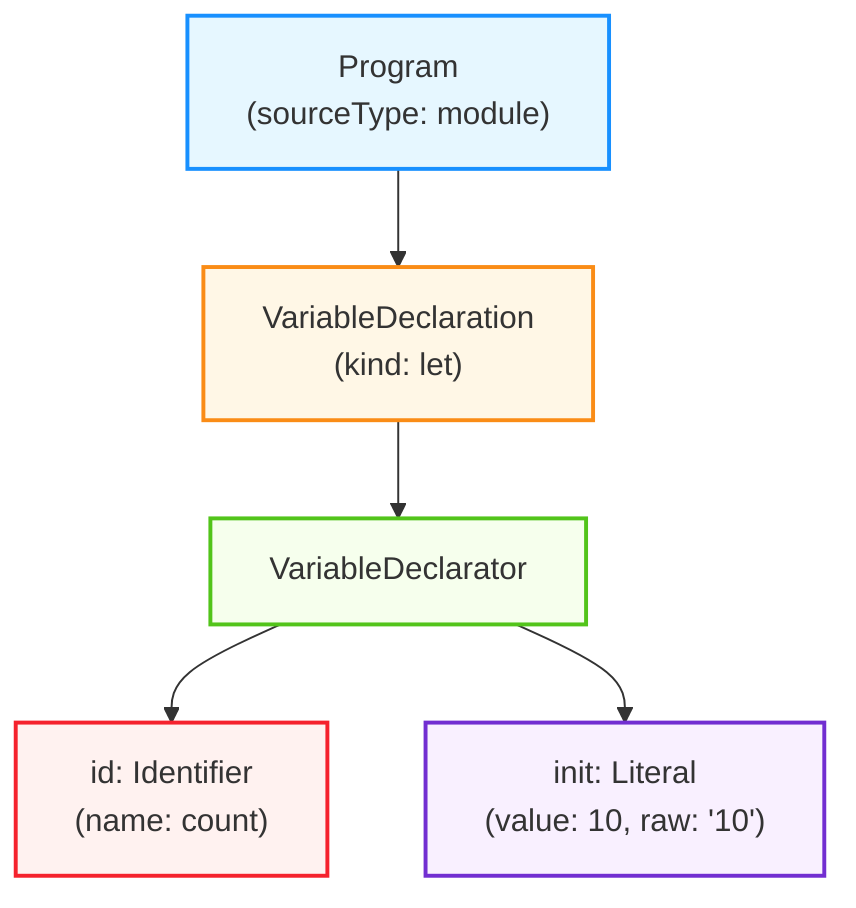
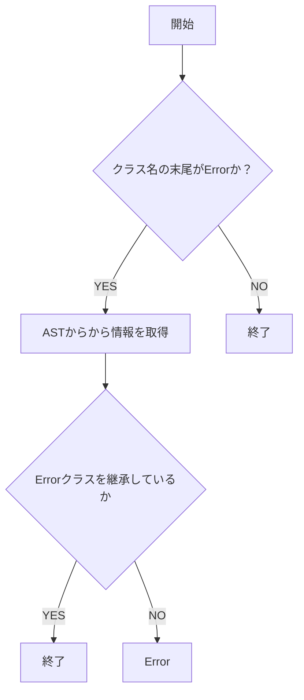

それでは発表させていただきます。よろしくお願いします。

早速ですが、皆さんのチームでは TypeScript のコーディング規約をどのように管理していますでしょうか？  
TypeScript や JavaScript のベストプラクティスに準ずるような、基本的なコーディング規約は ESLint などのツールを使用されていることが多いと思います。  
では、チーム独自のコーディング規約についてはどうでしょうか？  
これらはドキュメント化されていることもあれば、暗黙の了解となっていることもあるのかなと思います

コーディング規約の運用の理想は、チーム独自や社内独自、あるいは、特定のライブラリ独自 といった、スコープが狭いコーディング規約についても運用を自動化し、レビューコストを上げずに、チーム全体のコードの品質や安全性を高めることだと思います。  
今回は、そのアプローチとして、「特定の領域のコーディング規約を、ESLint ルールとして定義する」という内容について、ESLint カスタムルールの開発入門というタイトルで発表させていただきます。

---

自己紹介です。山梨と申します  
株式会社メイツで Web エンジニアをしております  
プライベートでは、AWS CDK という IaC ツール (インフラをコードで構築するツール) のコントリビュートをしたり、CDK 用の ESLint プラグインを開発したりしています

---

本セッションの目的とは、先ほどの通り、カスタムルールの開発手法を知り、より詳細な粒度でコーディング規約を自動化できるようにすることです。

このセッションでは、そういったカスタムルール開発の理解を深めるためのお話を、段階的にいたします。  
具体的にはこちらの流れでお話しします。

```md
1. ESLint とは
2. AST とは
3. ESLint を使用したカスタムルールの開発
4. typescript-eslint を使用したカスタムルールの開発
5. 型情報 を使用したカスタムルールの開発
```

最初に、ESLint や ESLint カスタムルールの概要についてお話しします。  
そして、ESLint カスタムルールの開発に不可欠である、AST の概要についてお話しします。  
AST というと難易度が高い印象を受ける方も多いかもしれませんが、今回は入門として、コードを例に挙げながら、大まかな概要について触れていきます。  
その後、実際にシナリオを立てて、ESLint カスタムルールの開発へと進みます。  
カスタムルールの開発は、まず、JavaScript コードを対象とした ESLint ルールの開発について触れ、その後 TypeScript コードを対象としたルールの開発についてお話しします。  
その後、AST のみでなく、型情報を使用したカスタムルールの開発へと進みます。  

---

ではまず、ESLint についてです

---

ESLint とは、JavaScript の Linter で、一貫性のあるコードを書くためだったり、コードの品質や安全性を高めることを目的として使用されると思います。  
この ESLint の特徴としては、typescript-eslint により TypeScript 構文がサポートされる点、そして、カスタムルールなどの開発が可能で、拡張性が高い点が挙げられます。  
カスタムルールと聞くとあまり馴染みがないように思えますが、例えば eslint-plugin-vue, eslint-plugin-react のような、普段使用しているライブラリやそのコミュニティによって提供されるプラグインも、カスタムルールの一つです。

ここからは、そのカスタムルールの概要についてまとめます。

ESLint には、カスタムルールを作成するためのモジュール、インターフェースがあり、その提供されたインターフェースに沿って記述することで、カスタムルールを開発することができます。  
ここで記述されたカスタムルールは、eslint が AST を 探索 する際にフックされ、呼び出されます。  
そのため、ESLint から提供された AST を参照し、それを元に、特定の条件に従うかを判定する実装を行う。というのが、カスタムールール開発の主な内容になります。

```ts
import { Rule } from "eslint";

export const sampleRule: Rule.RuleModule = {
  meta: {
    // ルールのメタデータを記述
  },
  create(context) {
    // ルールを記述
  },
};
```

また、開発したカスタムルールは、プラグインとしてプロジェクト内外に公開することで、設定ファイルに追加できるようになります。

```ts
const plugin = {
  rules: {
    "sample-rule": sampleRule,
  },
};

export default plugin;
```

```js
import eslint from "@eslint/js";
import myRule from "./example-rule";

export default [
  eslint.configs.recommended,
  {
    plugins: {
      example: myRule,
    },
    rules: {
      "example/sample-rule": "error",
    },
  },
];
```

より具体的な例で見てみます。  
チームのコーディング規約として、if 文は必ず Block を使用したい。つまり波括弧で囲うようにしたいというユースケースがあると仮定した場合、カスタムルールの内容はこちらのコードのようになります。

```ts
import { Rule } from "eslint";

export const requireIfBlock: Rule.RuleModule = {
  meta: {
    type: "problem",
    docs: {
      description: "if文を Block Statement で記述することを強制する",
    },
    messages: {
      requireIfBlock: "if文にブロックを使用してください",
    },
  },
  create(context) {
    return {
      IfStatement(node) {
        if (node.consequent.type !== "BlockStatement") {
          context.report({
            node,
            messageId: "requireIfBlock",
          });
        }
      },
    };
  },
};
```

このコードでは、`node`という変数名で JavaScript の AST を受け取り、それに対する操作を行なっています。  
このように、ESLint のカスタムルールを実装する際には、AST への理解が求められます。

そのため、ここからは、AST の概要についてお話しします。

---

AST とは、ソースコードをパースした抽象構文木、Abstract Syntax Tree のことで、JavaScript の場合は JSON として表現されます。  
例えば、`let count = 10`というコードは、非常に単純化すると、こちらのような JSON 構造で表現されるといったイメージです。

```json
{
  "type": "Program",
  "body": [
    {
      "type": "VariableDeclaration",
      "declarations": [
        {
          "type": "VariableDeclarator",
          "id": {
            "type": "Identifier",
            "name": "count"
          },
          "init": {
            "type": "Literal",
            "value": 10,
            "raw": "10"
          }
        }
      ],
      "kind": "let"
    }
  ],
  "sourceType": "module"
}
```

この JSON をグラフで表すと、こちらのようになります。



このように、AST はコードの構造を階層的に表現する「木構造」です。そして、各ノードがコードの一部を表し、そのノード間の親子関係がコードの構文的な関係を示します。

こちらの JSON を見てみると、最上位の`Program`ノードの中に、`VariableDeclaration`つまり変数宣言のノードがあることがわかります。  
この変数宣言は`kind: "let"`で宣言の種類を示し、`declarations`配列の中に具体的な変数情報を持っています。

その中の`VariableDeclarator`ノードが、変数名と初期値の情報を表しています。

このように、たった 1 行のコードであっても、AST はその構造を明確に階層化して表現しています。

---

その AST をソースコードから生成する流れとしては、こちらの図のようになります。


まずソースコードを字句解析してトークンに分解し、そのトークンを構文解析して AST を生成するといった流れです。

ここでの字句解析とは、ソースコードを予約語、変数名、記号などの、ある程度の意味の塊に分解することです。  
先ほどの、`let count = 10;` というソースコードを字句解析すると、  
`let` と `count` と `=` と `10` と `;(セミコロン)` という単位に分解されます。

字句解析によって生成されたトークンは、構文解析器によって解析され、トークンの意味だったり、並び方を見て、階層構造を構築し、AST が生成されます。  
ここで生成される AST では、スペースの数など、表面的な表現の違いが吸収され、コードの本質的な意味や構造だけを抽出して表現されます。  
AST とは Abstract Syntax Tree の略ですが、この Abstract, つまり抽象とは、スペースの数などといった表面的な表現の違いに左右されないことを意味します

ちなみに、ESLint では、ソースコードから AST を生成するといったパース処理を、`espree`という parser を使用して行っています。

---

ここまで、AST の概要について触れていきました。  
ここからは、実際にシナリオを立てて、そのシナリオを元にカスタムルールを開発していきます。

最終的には型情報を使用したルールについてお話ししますが、段階的に進めるために、まずは、ESLint のみを使用したカスタムルールの開発についてお話しします。  
ここでは TypeScript コードを対象とせず、 JavaScript コードを対象として、ざっくりとしたカスタムルールの開発の流れを掴みます。

紹介する内容についてですが、実は、ESLint カスタムルール開発をどのように書くかというドキュメントが、公式から公開されています。https://eslint.org/docs/latest/extend/custom-rule-tutorial

なので、ここのセッションでは、「カスタムルールを書くためにはどこに何を書くのか」といったインターフェースの細かい解説を行うのではなく、「どのようにルールを形成していくのか」という、ルールの組み立て方やノウハウといったところについてお話しします。  
ちなみに、今回のセッションでは ESLint から提供されるインターフェースの細かい情報は知らなくても理解できると思いますので、そこはご安心ください。  
もし今回のセッションを聞いて、カスタムルールを実装してみたいという思う方がいらっしゃいましたら。どこに何を書くのかといった細かい部分については、是非公式ドキュメント等も参考にしていただけたらと思います。

では、実装に進みます。  
今回は、if 文は必ず Block を使用したいというユースケースがあると仮定して、ルールを作成していきます。  
ルール開発の流れとしては、このようになります。

```md
1. 正常ケース・異常ケースのコード考える
2. それぞれのケースのコードの AST を見ながら、ルールを実装する
3. テストを実装する
```

まず、テストケースとして、どのようなコードを正常とし、どのようなコードを異常とするのかを考えます。  
その後、正常系、異常系それぞれのコードの AST の内容を見ながら、ルールを実装していきます。  
最後に、テストの実装を行います。

今回実装するルールは非常に単純なものですが、ルールの複雑性が増しても、基本的な開発の流れは同じです。

---

まず、正常ケース・異常ケースのコードについてです。
今回の、「if 文に必ず Block を使用する」というルールを考えると、こちらのように、Block が使われている。つまり`{}`で囲われている場合は正常なケースとし、Block が使われていない(`{}`で囲われていない場合は)エラーとします。

```ts
// ✅
if (true) {
  sampleFn();
}

// ❌
if (true) sampleFn();
```

こちらのコードを元に、実際の AST を見てみます。  

コードの AST を見る際には、 [ast explorer](https://ast-explorer.dev/) というサイトが非常に便利です  
このセッションで紹介している AST はそのサイトで確認した AST を 非常に単純化にしたものを使用しております。  
こちらがその AST の内容です。

正常としたいコードの AST と、異常としたいコードの AST を比較してみると、`IfStatement`のノードのプロパティである`consequent`の中身に違いがあることが確認できます。  
正常としたい AST の方では、`consequent`の type が`BlockStatement`であるのに対し、異常としたい AST の方は、`ExpressionStatement`となっています。

```jsonc
// 正常系
{
  "type": "Program",
  "body": [
    {
      "type": "IfStatement",
      "test": {
        "type": "Literal",
        "value": true,
        "raw": "true"
      },
      "consequent": {
        "type": "BlockStatement",
        "body": [
          {
            "type": "ExpressionStatement",
            "expression": {
              "type": "CallExpression",
              "callee": {
                "type": "Identifier",
                "name": "sampleFn"
              },
              "arguments": [],
              "optional": false
            }
          }
        ]
      }
    }
  ],
  "sourceType": "module"
}
```

```json
// 異常系
{
  "type": "Program",
  "body": [
    {
      "type": "IfStatement",
      "test": {
        "type": "Literal",
        "value": true,
        "raw": "true"
      },
      "consequent": {
        "type": "ExpressionStatement",
        "expression": {
          "type": "CallExpression",
          "callee": {
            "type": "Identifier",
            "name": "sampleFn"
          },
          "arguments": [],
          "optional": false
        }
      }
    }
  ],
  "sourceType": "module"
}
```

これを元に自然言語でルールを定義すると、「`IfStatement`の consequent が`BlockStatement`でない場合はエラーにする」というようになります。

これを実際にコードに落すと、こちらのようになります。

```ts
import { Rule } from "eslint";

export const requireIfBlock: Rule.RuleModule = {
  meta: {
    type: "problem",
    docs: {
      description: "if文を Block Statement で記述することを強制する",
    },
    messages: {
      requireIfBlock: "if文にブロックを使用してください",
    },
  },
  create(context) {
    return {
      IfStatement(node) {
        if (node.consequent.type !== "BlockStatement") {
          context.report({
            node,
            messageId: "requireIfBlock",
          });
        }
      },
    };
  },
};
```

今回定義するルールは、If 文のノードに対する操作を行いたいので、`create`メソッドの`return`に`IfStatement`を指定しています。  
これにより、eslint が `IfStatement` のノードを探索する際に、記述した処理が実行されます。

そして、定義した通り、consequent の type が `BlockStatement` でない場合はエラーにします。

ルールの実装は、これで終わりです。  
JavaScript コードを対象とした ESLint のルール実装は、このように、ほとんどの場合で AST に沿って実装していく作業になります。

<br />

さて、ここまでで、ルールの実装が完了しましたので、最後にテストを実装します。

テストを実装する際には、eslint から提供される `RuleTester`というモジュールを使用します。
そして、こちらのコードのように、ruleTester の`run`メソッドを使用して、テスト対象のモジュールを指定し、正常系・異常系のテストケースを書きます。

テストの実行は、vitest, jest など、普段使用しているテストフレームワークで行えます。  
ここまでが、ESLint を使用した、カスタムルールの基本的な開発の流れになります。

---

続いては、TypeScript 構文もサポートしたカスタムルールの開発を行なっていきたいと思います。

まず、前提としてですが、ESLint だけでは、TypeScript コードを対象とした Lint を実行することはできません。  
それは、ESLint のパーサーとして使用されている `espree` は JavaScript の parser であり、 TypeScript 構文はサポートされていないからです。

そこで、`typescript-eslint` を使用します。  
`typescript-eslint`では、`@typescript-eslint/typescript-estree` で TypeScript コード用の AST を生成し、`@typescript-eslint/parser`で ESLint が TypeScript のソースコードを lint できるようにしています。

```md
> A parser that produces an ESTree-compatible AST for TypeScript code.

引用: https://github.com/typescript-eslint/typescript-eslint/tree/main/packages/typescript-estree

> An ESLint parser which leverages TypeScript ESTree to allow for ESLint to lint TypeScript source code.

引用: https://github.com/typescript-eslint/typescript-eslint/tree/main/packages/parser
```

`typescript-eslint`にも、ESLint 同様に、カスタムルールを作成するためのモジュールが提供されています。  
これを使用することで、TypeScript コードを対象としたカスタムルールの作成が可能になります。

これから、`typescript-eslint`を使用したカスタムルールの開発についてこちらの二つの段階に分けて進めていきます。

```md
1. TypeScript コードの AST を使用したルールの開発
2. TypeScript コードの AST と型情報を使用したルールの開発
```

どちらも TypeScript コードの AST を対象としていますが、二つ目の方では、AST だけでなく、型情報も使用したリントルールを実装していきます。

では早速ひとつめの、TypeScript コードの AST を使用したルールの開発についてお話しします。
今回はシナリオとして、「interface のプロパティには必ず readonly をつける」というルールを実装していきます。

開発の流れは、先ほどの ESLint カスタムルールの開発と同様の流れになります。

```md
1. 正常ケース・異常ケースのコード考える
2. それぞれのケースのコードの AST を見ながら、ルールを実装する
3. テストを実装する
```

まず、テストケースとして、どのようなコードを正常とし、どのようなコードを異常とするのかを考えます。  
その後、正常系、異常系それぞれのコードの AST の内容を見ながら、ルールを実装していきます。  
最後に、テストの実装を行います。

---

まず、正常ケース・異常ケースのコードについてです。
今回の、「interface のプロパティには必ず readonly をつける」というルールを考えると、このように、プロパティに`readonly`が使われている場合は正常なケースとし、`readonly`が使われていない場合はエラーとします

```ts
interface Sample {
  // ✅
  readonly a: string;

  // ❌
  b: string;
}
```

こちらのコードを元に、実際の AST を見てみます。  
今回も ast explorer のサイトを参考に、非常に単純化した AST を載せています。

AST を見ると、`TSPropertySignature`というタイプのノードには、`readonly`というプロパティがあることがわかります。  
つまり、この`readonly`プロパティが true の場合は正常とし、false の場合は異常とするといった実装内容になりそうです。

```jsonc
{
  "type": "Program",
  "body": [
    {
      "type": "TSInterfaceDeclaration",
      "body": {
        "type": "TSInterfaceBody",
        "body": [
          {
            "type": "TSPropertySignature",
            "computed": false,
            "key": {
              "type": "Identifier",
              "decorators": [],
              "name": "a",
              "optional": false
            },
            "optional": false,
            "readonly": true,
            "static": false,
            "typeAnnotation": {
              "type": "TSTypeAnnotation",
              "typeAnnotation": {
                "type": "TSStringKeyword"
              }
            }
          },
          {
            "type": "TSPropertySignature",
            "computed": false,
            "key": {
              "type": "Identifier",
              "decorators": [],
              "name": "b",
              "optional": false
            },
            "optional": false,
            "readonly": false,
            "static": false,
            "typeAnnotation": {
              "type": "TSTypeAnnotation",
              "typeAnnotation": {
                "type": "TSStringKeyword"
              }
            }
          }
        ]
      },
      "declare": false,
      "extends": [],
      "id": {
        "type": "Identifier",
        "decorators": [],
        "name": "Sample",
        "optional": false
      }
    }
  ]
}
```

これを実際にコードに落とすと、こちらのようになります

```ts
import { AST_NODE_TYPES, ESLintUtils } from "@typescript-eslint/utils";

export const requireReadonlyInInterface = ESLintUtils.RuleCreator.withoutDocs({
  meta: {
    type: "problem",
    messages: {
      requireReadonlyInInterface: "readonly を使用してください",
    },
    schema: [],
  },
  defaultOptions: [],
  create(context) {
    return {
      TSInterfaceDeclaration(node) {
        for (const interfaceBody of node.body.body) {
          if (
            interfaceBody.type === AST_NODE_TYPES.TSPropertySignature &&
            !interfaceBody.readonly
          ) {
            context.report({
              node: interfaceBody,
              messageId: "requireReadonlyInInterface",
            });
          }
        }
      },
    };
  },
});
```

今回定義するルールは、Interface 定義のノードに対する操作を行いたいので、`create`メソッドの`return`に`TSInterfaceDeclaration`を指定しています。  
これにより、eslint が`TSInterfaceDeclaration`のノードを探索する際に、記述した処理が実行されます。

処理の内容としては、interface のボディに対してループ処理を行い、ボディのタイプがプロパティで、かつreadonlyでない場合は、エラーにします。

ルールの実装は、これで終わりで、続いて、テストを実装します。

テストを実装する際には、`typescript-eslint` から提供される `RuleTester`というモジュールを使用します。
そして、こちらのコードのように、ruleTester の`run`メソッドを使用して、テスト対象のモジュールを指定し、正常系・異常系のテストケースを書きます。

テストの実行は、vitest, jest など、普段使用しているテストフレームワークで行えます。  
ここまでが、`typescript-eslint` を使用した、カスタムルールの基本的な開発の流れになります。

ここまでは、JavaScript や TypeScript の AST を利用し、カスタムルールを開発してきました。  
ここからは、AST と型情報を使用したカスタムルールの開発についてお話しします。

---

TypeScriptプロジェクトで`typescript-eslint`を使用するメリットとしては、TypeScript 構文がサポートされることと、型情報 Lint ルールが提供されることがあると思います。

`typescript-eslint`から提供される型情報Lintルール(TypeScript の型情報に基づいた Lint ルール)にはさまざまなものがあり、これは、品質の高いTypeScriptコードを書く際に非常に便利です。  

では、従来の ESLint ルールと、この型情報 Lint ルール違いとは何なのかでしょうか？  

従来の ESLint ルールは、一度に一つのファイルに対して実行され、プロジェクト内の他のファイルについての知識は持っていません。  
要するに、他のファイルの内容に基づいて、判断を下すことはできません。  
一方で、型情報 Lint ルールは、他のファイルの内容に基づいて判断を下すことができます。

実際に、typescript-eslint の `@typescript-eslint/no-for-in-array` というルールを例に見てみます。
このルールは、配列型の値に対する`for...in`を検出するものです。  
これ適用した場合、こちらのコードのように、別のファイルで定義されている関数の情報を見て、それが配列型であると判断し、`for..in`が使われている場合は、エラーとしています。

<!-- 参考: https://eslint.org/blog/2025/01/differences-between-eslint-and-typescript/#eslint-with-type-information -->

```ts
// declare function getArrayOfNames(): string[];
import { getArrayOfNames } from "./my-names";

for (const name in getArrayOfNames()) {
  // eslint(@typescript-eslint/no-for-in-array):
  // For-in loops over arrays skips holes, returns indices as strings,
  // and may visit the prototype chain or other enumerable properties.
  // Use a more robust iteration method such as for-of or array.forEach instead.
  console.log(name);
}
```

では、ESLint はどのようにして、他のファイルで定義された関数の型情報まで考慮して、このようなチェックを実現しているのでしょうか？そのあたりの仕組みについて簡単にまとめると、このようになります。

```md
1. `typescript-eslint/parser`を使用して AST を生成
2. TypeScript Compiler API を使用して、AST を元に型情報を取得
3. 取得した型情報と AST を元にチェック
```

かなりざっくりですが、`typescript-eslint/parser`を使用して TypeScript コードを parse し、AST を生成すると、その AST の型情報を、TypeScript Compiler API を使用して取得します。  
そして、取得した型情報と AST を元にチェックするといった感じです。

型情報 Lint ルールの概要について触れたところで、実際にルールの開発に移ります。

---

今回は、`typescript-eslint/parser`によって生成された AST から 型情報を取得する方法について理解を深めることを目的として、ルールを実装します。

架空のシナリオとして「カスタムエラークラスが、標準の`Error`クラスを継承しているかを判断し、継承していない場合は規約違反とする」というものを考えます。

具体的な正常ケース、異常ケースのコードとしては、こちらのようになります

```ts
// ✅ Good
export class SampleError extends Error {}

// ✅ Good
declare class BaseError extends Error {}
export class SampleError extends BaseError {}

// ❌ NG
export class SampleError {}

// ❌ NG
declare class BaseClass {}
export class BaseError extends BaseClass {}
```

`SampleError`や`BaseError`など、クラス名の末尾に 「Error」 とつく場合で、`Error`クラスを直接、あるいは間接的に継承している場合は正常としています。
一方で末尾に「Error」がつくクラスが、標準の Error クラスを継承していない場合は、異常としています。

このシナリオに基づいたルール実装の流れとしては、このようになります。

```md
1. 定義されたクラス名の末尾が`Error`かを判定
2. 末尾が`Error`の場合、AST から型情報を取得
3. 型情報を辿って、定義されたクラスが`Error`クラスを継承しているか判定
4. 継承していない場合はエラーとする
```



まず、AST の情報から、定義されたクラスのクラス名の末尾が`Error`かを判定します。  
YES の場合、AST から型情報を取得し、その型情報を辿って、定義されたクラスが`Error`クラスを継承しているか判定します。  
そして、継承していない場合はエラーとします。

ではさっそく、定義されたクラス名の末尾が`Error`かを判定する実装を行います。  
この実装を行うには、クラスを定義するコードから、どのような AST が生成するかを把握したいので、`SampleError`という名前のクラスを定義した時の AST を見てみます。

```jsonc
// class SampleError {}
{
  "type": "Program",
  "body": [
    {
      "type": "ClassDeclaration",
      "id": {
        "type": "Identifier",
        "name": "SampleError"
      },
      "body": {
        "type": "ClassBody",
        "body": []
      }
    }
  ],
  "sourceType": "module"
}
```

表示されているものは AST をかなり単純化したものですが、ClassDeclarations の`id`プロパティの`name`に、クラス名が格納されていることがわかります。  
そのため、クラス名の末尾が`Error`になっているかを判断するコードをこのように実装します

```ts
import { ESLintUtils } from "@typescript-eslint/utils";
import { SymbolFlags, Type } from "typescript";

export const requireExtendsError = ESLintUtils.RuleCreator.withoutDocs({
  meta: {
    // ...
  },
  create(context) {
    const parserServices = ESLintUtils.getParserServices(context);
    return {
      ClassDeclaration(node) {
        if (!node.id?.name.endsWith("Error")) return;
      },
    };
  },
});
```

続いて、AST から型情報を取得する実装を行います。

AST から型情報を取得する際には、typescript の `getTypeAtLocation` という関数を使用します。

```ts
getTypeAtLocation(node: Node): Type;
```

この関数は、TypeScript の AST ノードを受け取ると、型情報を返す関数です

つまり、この `getTypeAtLocation` を呼び出すことで、AST から 型情報を取得できるといった感じになります。

ただ、ここで注意したいのは、`getTypeAtLocation`が受け取る AST ノードは、TypeScript の世界の AST ノードであり、`typescript-eslint`が生成する AST ノードではないということです。  
そのため、`typescript-eslint`が生成する AST を`typescript`の AST に変換し、それを`getTypeAtLocation`関数に渡す必要があります

そこで、`typescript-eslint`から提供される、`parserServices`を使用します。  
具体的なコードは、このようになります

```ts
const parserServices = ESLintUtils.getParserServices(context);
return {
  ClassDeclaration(node) {
    if (!node.id?.name.endsWith("Error")) return;
    const nodeType = parserServices.getTypeAtLocation(node);
  },
};
```

この parserServices に含まれる`getTypeAtLocation`は`typescript-eslint`の AST Node を受け取り、型情報を返す関数です。

この関数では内部的に、`typescript-eslint`の AST Node を TypeScript の AST Node に変換し、TypeScript の`getTypeAtLocation`つまり先ほど紹介した、TypeScript の AST Node を受け取り型情報を取得する関数を呼び出しています。

参考: https://github.com/typescript-eslint/typescript-eslint/blob/main/packages/typescript-estree/src/createParserServices.ts#L35-L36

ここまでで、AST から型情報を取得する実装が完了したので、続いて、型情報を辿って、定義されたクラスが`Error`を継承しているかを判定する実装を行います。

今回のルール実装では、自身の型情報のみではなく、クラスの継承元の型情報も必要となるため、再起的に親の型情報を取得し、`Error`クラスを継承しているかを判定する実装を行います。

この要件を満たした具体的なコードは、このようになります。

```ts
const nodeType = parserServices.getTypeAtLocation(node);

const isExtendedError = (type: Type): boolean => {
  if (type.symbol.flags === SymbolFlags.Class && type.symbol.name === "Error") {
    return true;
  }
  const baseTypes = type.getBaseTypes() ?? [];
  return baseTypes.some((baseType) => isExtendedError(baseType));
};
```

今回は`isExtendedError`という名前の関数を定義し、`Error`を継承している場合は true を返すようにしています。  
この関数では、`Type`,つまり型情報を見て、クラス名が`Error`の場合は、true を返すようにしています。
また、`typescript`の`getBaseTypes`関数を使用して、親の型情報を取得し、再起的に`isExtendedError`関数を呼び出すようにしています。

ここまで実装できればあとは簡単で、この関数を実行し、Error を継承していない場合は、規約違反とみなすように実装します。  
具体的にはこちらのようなコードになります

```ts
if (isExtendedError(nodeType)) return;

context.report({
  node: node.id,
  messageId: "requireExtendsError",
});
```

ここまでで、型情報を使用したカスタムリントルールの実装が完了しました。

最後にまとめです。
