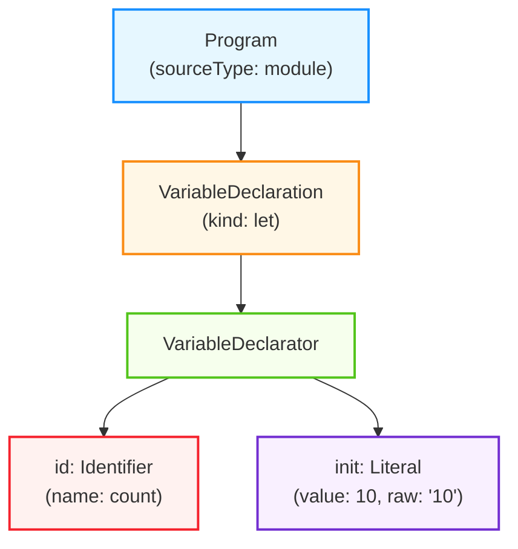
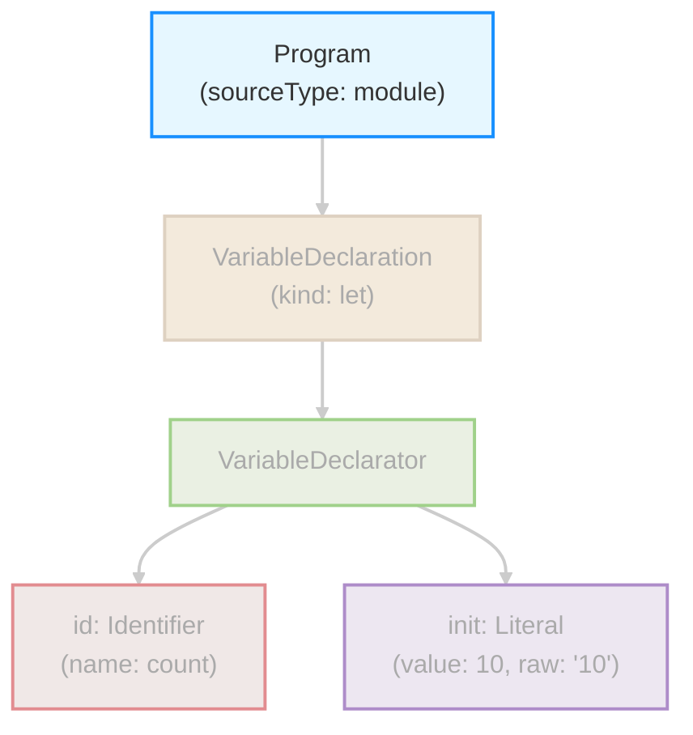
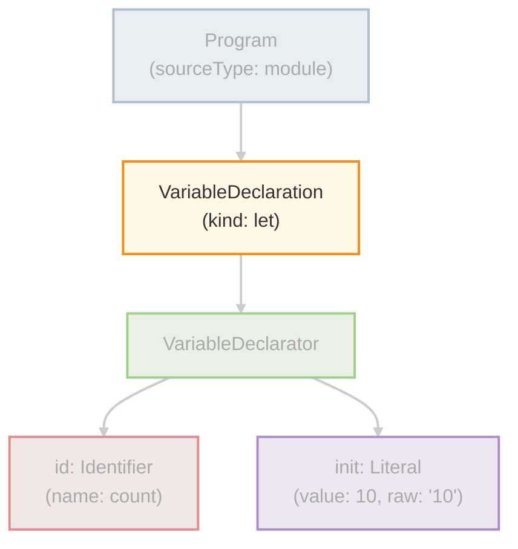
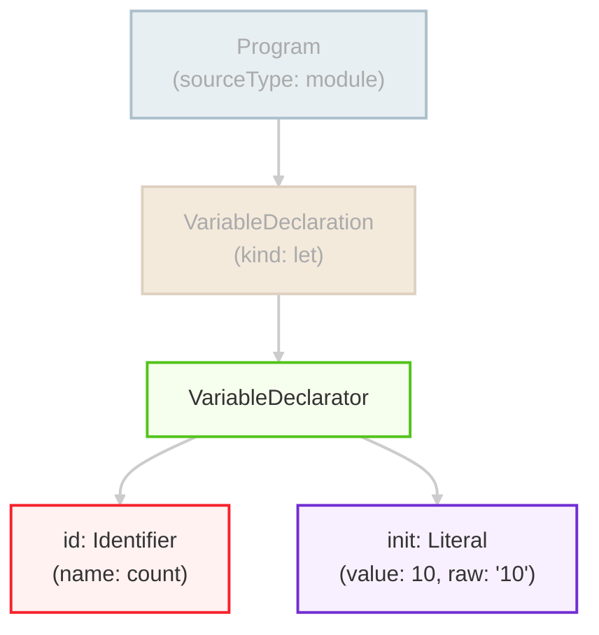

<style scoped>
.slidev-vclick-hidden {
  display: none;
}
.small-code {
  .slidev-code {
    font-size: 0.87rem !important;
    line-height: 0rem !important;
    width: 400px !important;
  }
}
</style>

<section-title title="AST とは？" />

<v-clicks class="_bullet">

* コードをパースした抽象構文木(Abstract Syntax Tree)
* `let count = 10;` というコードの場合

</v-clicks>

<div v-click="[3]" class="flex justify-start small-code pl-12.5">

```json{*}
{
  "type": "Program",
  "body": [{
    "type": "VariableDeclaration",
    "kind": "let",
    "declarations": [{
      "type": "VariableDeclarator",
      "id": { 
        "type": "Identifier", 
        "name": "count" 
      },
      "init": {
        "type": "Literal",
        "value": 10
      }
    }],
  }]
}
```

</div>

<div v-click="4" class="flex justify-around small-code">

```json{*|*|2|4|4-5|6-16|7-15}
{
  "type": "Program",
  "body": [{
    "type": "VariableDeclaration",
    "kind": "let",
    "declarations": [{
      "type": "VariableDeclarator",
      "id": { 
        "type": "Identifier", 
        "name": "count" 
      },
      "init": {
        "type": "Literal",
        "value": 10
      }
    }],
  }]
}
```

<div v-click="[4]">



</div>

<div v-click="[5]">



</div>

<div v-click="[6]">



</div>

<div v-click="[7]">


</div>

<div v-click="[8]">


</div>

<div v-click="[9]">



</div>

<div v-click="10">


</div>

</div>

<!-- 

AST とは、

[click] ソースコードをパースした抽象構文木、Abstract Syntax Tree のことで、JavaScript の場合は JSON として表現されます。  

[click] 例えば、"let count = 10;" というコードは、非常に単純化すると、  
[click] こちらのような JSON 構造で表現されるといったイメージです。そしてこの JSON をグラフで表すと、  
[click] こちらのようになります。

このように、AST はコードの構造を階層的に表現する「木構造」です。  
そして、各ノードがコードの一部を表し、そのノード間の親子関係がコードの構文的な関係などを示します。

こちらを見てみると、
[click]最上位の Program ノードの中に、
[click] VariableDeclaration つまり変数宣言のノードがあることがわかります。

[click]この変数宣言は "kind: let" で宣言の種類を示し、
[click] declarations 配列の中に具体的な変数情報を持っています。

[click]その中の VariableDeclarator ノードが、変数名と初期値の情報を表しています。

[click]このように、たった 1 行のコードであっても、AST はその構造を明確に階層化して表現しています。
-->