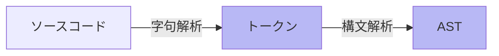

<style scoped>
.slidev-vclick-hidden {
  display: none;
}

.small-code {
  .slidev-code {
    font-size: 0.77rem !important;
    line-height: 0rem !important;
    width: 300px !important;
  }
}

.image {
  border-radius: 5px;
  box-shadow: 0px 10px 15px 0px gray;
  margin: 40px auto auto auto;
}
</style>

<section-title title="AST を生成する流れ" />

<div class="_bullet" v-click="[0]">



* 構文解析: 字句解析で得られたトークンを並び方やそれぞれの意味で分析し、ASTを生成

<v-drag-arrow pos="384,317,148,1"/>

<div class="mt-2 flex justify-around">

```json{*}
{
  "kLet": let,
  "kIdentifier": count,
  "kAssign": =,
  "kNumber": 10,
  "kSemicolon": ;
}
```

<div class="small-code">

```json{*}
{
  "type": "Program",
  "body": [{
    "type": "VariableDeclaration",
    "kind": "let",
    "declarations": [{
      "type": "VariableDeclarator",
      "id": { 
        "type": "Identifier", 
        "name": "count" 
      },
      "init": {
        "type": "Literal",
        "value": 10
      }
    }],
  }]
}
```

</div>

</div>

</div>

<div class="_bullet" v-click="1">

- コードの AST を確認する方法
  - https://ast-explorer.dev


</div>

<!--
字句解析によって生成されたトークンは、構文解析器によって解析され、トークンの意味だったり、並び方を見て、階層構造を構築し、AST が生成されます。  
ここで生成される AST では、スペースの数などといった、表面的な表現の違いが吸収され、コードの本質的な意味や構造だけを抽出して表現されます。  

AST とは そういったプログラムの解析に際して、重要でない情報を捨て、必要な要素だけを抜き出して把握しやすくした構文木。という意味です。  

[click] ちなみに、ソースコードの AST は ast explorer というサイトで確認することができます。  
このセッションで紹介している AST は全てこちらのサイトで確認したものを使用しております。
-->
