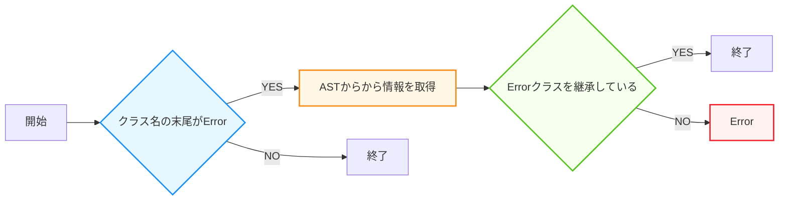

* カスタムエラークラス(e.g. `NotExistsError`)に `Error` クラスの継承を強制するルール

#### 開発の流れ

1. 定義されたクラス名の末尾が`Error`かを判定
2. 末尾が`Error`の場合、AST から型情報を取得
3. 型情報を辿って、定義されたクラスが`Error`クラスを継承しているか判定
4. 継承していない場合はエラーとする

<!-- 
まず、AST の情報から、定義されたクラスのクラス名の末尾が`Error`かを判定します。  
末尾が`Error` の場合、AST から型情報を取得し、その型情報を辿って、定義されたクラスが`Error`クラスを継承しているか判定します。  
そして、定義したクラスが Error クラスを継承していない場合はエラーとします。
-->