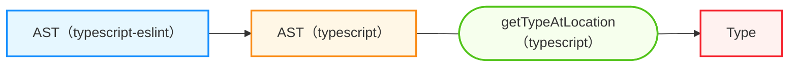

<style scoped>
.slidev-vclick-hidden {
  display: none;
}
</style>

<div class="_bullet">

2. 末尾が`Error`の場合、AST から型情報を取得

* `typescript-eslint` の `getTypeAtLocation` 関数を使用

```ts{*}
import { ESLintUtils } from "@typescript-eslint/utils";

// ...
const parserServices = ESLintUtils.getParserServices(context);
// ...
const nodeType = parserServices.getTypeAtLocation(node);
```

<div v-click="1" class="mt-7">

#### typescript-eslint の `getTypeAtLocation` の処理の流れ

1. typescript-eslint の AST を typescript の AST に変換
2. typescript の `getTypeAtLocation` を呼び出して、 typescript の AST から型情報を取得

<div class="text-sm mt-1" v-click.hide="1">

ref: https://github.com/typescript-eslint/typescript-eslint/blob/main/packages/website/src/components/linter/createParser.ts#L100-L103

</div>



</div>

</div>

<!--
`typescript-eslint`の AST Node から、型情報を取得するには、こちらのコードのように、`typescript-eslint` の `getTypeAtLocation` 関数を使用します。

[click] この `typescript-eslint` の getTypeAtLocation 関数では、こちらの図のように、typescript-eslint の AST Node を typescript の AST Node に変換した上で、typescript の `getTypeAtLocation` 関数を呼び出しています。

-->
