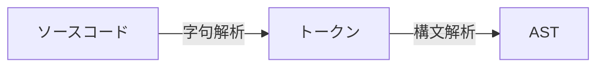

<section-title title="AST とは？" />

* コードをパースした抽象構文木(Abstract Syntax Tree)

<!-- 

AST とは、ソースコードをパースした抽象構文木のことで、JavaScript の場合は JSONとして表現されます。

[click] ソースコードからASTを生成する流れとしては、ソースコードを字句解析してトークンに分解し、そのトークンを構文解析してASTを生成するというようになります。
-->