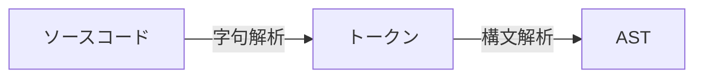

<section-title title="AST とは？" />

<div class="_bullet">

- コードをパースした抽象構文木(Abstract Syntax Tree)

</div>

<div>



</div>

<div class="_bullet">

- 字句解析: ソースコード(文字)を予約語, 変数名, 記号などのある程度の意味の塊(トークン)に分解する

</div>

````md magic-move
```ts{*}
let count = 10;
```

```json{*}
// 参考: https://github.com/v8/v8/blob/13.7.105/src/parsing/token.h
{
  "kLet": let,
  "kIdentifier": count,
  "kAssign": =,
  "kNumber": 10,
  "kSemicolon": ;
}
```
````

<!-- 
字句解析とは、ソースコードを予約語、変数名、記号などの、ある程度の意味の塊に分解することです。  
例えば、`let count = 10` というソースコードを字句解析すると、  
[click] let, count, =, 10, ;(セミコロン) という単位に分解されます。
-->
