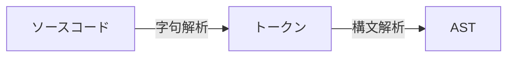

<section-title title="AST とは？" />

<div class="_bullet">

* コードをパースした抽象構文木(Abstract Syntax Tree)

</div>

<div>



</div>

<div class="_bullet">

* 構文解析: 字句解析で得られたトークンの並び方を見て、プログラムの文法ルールに従って、全体の構造を解析する

</div>

````md magic-move
```json{*}
// 参考: https://github.com/v8/v8/blob/13.7.105/src/parsing/token.h
{
  "kLet": let,
  "kIdentifier": count,
  "kAssign": =,
  "kNumber": 10,
  "kSemicolon": ;
}
```

```json{*}
// let is ...
```
````

<!-- 

-->