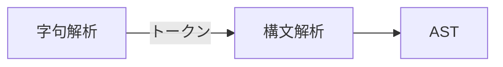

<section-title title="AST とは？" />

<div class="_bullet">

* コードをパースした抽象構文木(Abstract Syntax Tree)

</div>

<div>



</div>

<div class="_bullet">

* 構文解析: 字句解析で得られたトークンの並び方を見て、プログラムの文法ルールに従って、全体の構造を解析する

</div>

````md magic-move
```json{*}
{
  "keyword": let,
  "variable_name": count,
  "operator": =,
  "num_literal": 10,
  "final_symbol": ;
}
```

```json{*}
// let is ...
```
````
