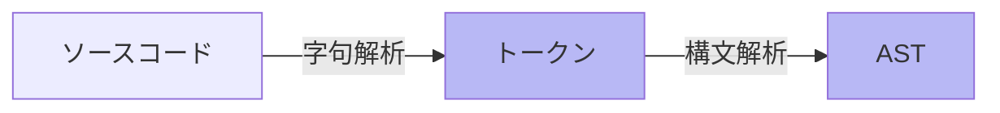

<style scoped>
.slidev-vclick-hidden {
  display: none;
}

.small-code {
  .slidev-code {
    font-size: 0.4rem !important;
    line-height: 0rem !important;
    width: 300px !important;
  }
}
</style>

<section-title title="AST とは？" />

<div class="_bullet">

* コードをパースした抽象構文木(Abstract Syntax Tree)

</div>

<div>



</div>

<div class="_bullet">

* 構文解析: 字句解析で得られたトークンを並び方やそれぞれの意味で分析し、ASTを生成

</div>

<v-drag-arrow pos="394,397,127,1"/>

<div class="mt-5 flex justify-around">

```json{*}
{
  "kLet": let,
  "kIdentifier": count,
  "kAssign": =,
  "kNumber": 10,
  "kSemicolon": ;
}
```

<div class="small-code">

```json{*}
{
  "type": "Program",
  "body": [
    {
      "type": "VariableDeclaration",
      "declarations": [
        {
          "type": "VariableDeclarator",
          "id": {
            "type": "Identifier",
            "name": "count"
          },
          "init": {
            "type": "Literal",
            "value": 10,
            "raw": "10"
          }
        }
      ],
      "kind": "let"
    }
  ],
  "sourceType": "module"
}
```

</div>

</div>

<!-- 
字句解析によって生成されたトークンは、構文解析器によって解析され、ASTが生成されます。  
ここで生成されるASTでは、スペースの数など、表面的な表現の違いが吸収され、コードの本質的な意味や構造だけを抽出して表現されます。ASTのAbstract, つまり抽象とは、そういった表面的な表現の違いに左右されないことを意味します
-->