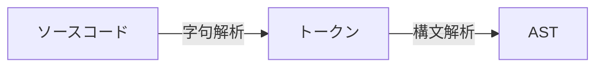
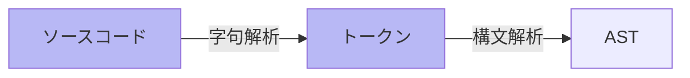

<section-title title="AST を生成する流れ" />

- 字句解析: ソースコード(文字)を予約語, 変数名, 記号などのある程度の意味の塊(トークン)に分解する

<!-- 
その AST をソースコードから生成する流れとしては、こちらの図のようになります。  
まずソースコードを字句解析してトークンに分解し、そのトークンを構文解析して AST を生成するといった流れです。

[click] ここでの字句解析とは、ソースコードを予約語、変数名、記号などの、ある程度の意味の塊に分解することです。  
-->
